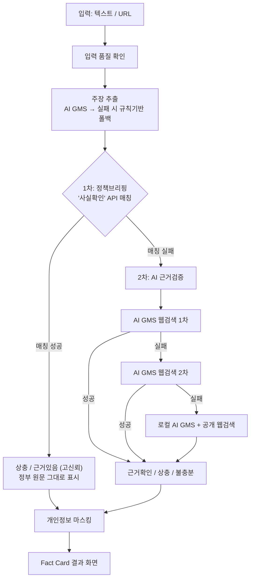

# SNS 속 가짜 정보 검증 서비스 팩트온(FactON)

> AI가 진위를 직접 판정하는 대신, 정부의 기존 공식반박을 우선 연결하고 그렇지 않은 경우엔
> 판정을 보류함으로써 시민이 정보의 근거를 스스로 확인할 수 있도록 돕는 사실확인 서비스.

카카오톡·SNS에서 접한 문장이나 뉴스 URL을 붙여넣으면, 핵심 주장을 자동으로 추출해
① 정부가 이미 반박한 공식자료(정책브리핑 '사실은 이렇습니다')와 우선 매칭하고,
② 매칭되지 않는 주장만 다중 생성형 AI의 웹검색 교차검증을 거쳐 근거확인·상충·불충분
3단계로 보여줍니다.

---

## 핵심 기능

- **텍스트/URL 입력** — 문장을 그대로 붙여넣거나 뉴스 URL을 입력하면 본문을 자동 추출(Readability)
- **주장 자동 추출** — AI GMS로 검증 가능한 핵심 주장 1~5개를 추출, 실패 시 규칙 기반 추출기로 폴백
- **1차: 정부 공식반박 매칭** — 문화체육관광부 정책브리핑 '사실확인' 코너와 매칭되면 AI가 새로
  판정하지 않고 정부 원문 그대로를 고신뢰로 연결
- **2차: 다중 AI 근거검증** — 매칭 실패 시 AI GMS(1차) → AI GMS(2차) → 로컬 AI GMS 순서로 자동
  폴백하며 공개 웹(Bing/Google News RSS) 근거와 대조해 근거확인/상충/불충분 3단계로 판정
- **판정 보류 우선** — 근거가 불충분하면 거짓으로 단정하지 않고 안전하게 보류
- **개인정보 마스킹** — 결과 화면의 전화번호·주민등록번호를 자동 마스킹, 입력 원문은 서버 미저장
- **결과 공유** — 검증 결과를 복사하거나 텍스트 파일로 저장해 가족 단톡방 등에 공유
- **부가 페이지** — 이용방법 안내(`/how`), 미디어 리터러시 자가진단(`/literacy`),
  허위정보 신고 안내(`/report`, KISO 연계), 정책·언론 공식 출처 디렉토리(`/sources`)

---

## 아키텍처



1. **입력 단계** — 텍스트는 그대로, URL은 `@mozilla/readability` + `jsdom`으로 본문만 추출합니다.
2. **주장 추출** — AI GMS가 수치·인용·단정 표현이 있는 문장을 우선해 핵심 주장을 뽑고,
   호출이 실패하면(API 키 없음, 쿼터 소진 등) 휴리스틱 기반 문장 추출로 자동 전환합니다.
3. **1차 매칭** — 공공데이터포털 정책브리핑 정책뉴스 API에서 최근 180일치 '사실확인' 콘텐츠를
   캐싱해두고, 주장과 같은 소재를 다루는 항목이 있으면 **AI가 새로 판정하는 것이 아니라**
   정부가 이미 내놓은 결론을 그대로 파싱해 보여줍니다.
4. **2차 검증(폴백 체인)** — 1차 매칭에 실패한 주장만 순서대로 AI GMS 1차(웹검색 도구) →
   AI GMS 2차(검색 그라운딩) → 로컬 AI GMS(공개 웹검색 결과 재판정)를 거칩니다.
   상위 단계가 전부 실패해도 서비스가 멈추지 않고 다음 단계로 자동 전환되도록 설계했으며,
   개발 중 실제 API 쿼터 소진 상황에서 이 폴백이 정상 동작함을 재현 검증했습니다.
5. **후처리** — 최종 결과는 `maskPII`로 전화번호·주민등록번호를 마스킹한 뒤 화면에 표시됩니다.

---

## 기술 스택

| 구분 | 기술 |
|---|---|
| 프레임워크 | Next.js 16 (App Router), React 19, TypeScript 5 |
| 스타일 | Tailwind CSS 4 |
| 1차 생성형 AI | AI GMS(SDK 연동) — 주장 추출, web_search 도구 기반 근거검증 |
| 2차 생성형 AI | AI GMS(REST API) — 검색 그라운딩 또는 검색결과 재판정 |
| 3차 생성형 AI | 로컬 AI GMS(`qwen3:8b`) — 최종 폴백 근거 판정 |
| 본문 추출 | `@mozilla/readability` + `jsdom` |
| 공공데이터 | 문화체육관광부 정책브리핑 정책뉴스 API(`policyNewsService2`) |
| 공개 검색 | Bing RSS, Google News RSS |
| 개발 도구 | ESLint 9, TypeScript strict mode |

---

## 프로젝트 구조

```
app/
  api/analyze/route.ts     # 분석 파이프라인 진입점(POST)
  page.tsx                 # 메인 입력·결과 화면
  how/                     # 이용방법 안내
  literacy/                # 미디어 리터러시 자가진단
  report/                  # 허위정보 신고 안내(KISO 연계)
  sources/                 # 정책·언론 공식 출처 디렉토리
components/                # InputForm, FactCard*, ShareCard, SiteHeader 등 UI 컴포넌트
lib/
  claims/extractClaims.ts        # 주장 추출(AI GMS → 규칙기반 폴백)
  match/policyNewsClient.ts      # 정책뉴스 API 연동 및 캐싱
  match/matchClaims.ts           # 1차 매칭(키워드 겹침 폴백 매처)
  match/parseVerdictFromSource.ts
  evidence/verifyClaim.ts        # 2차 검증 오케스트레이션(로컬 규칙 → AI GMS 1차 → AI GMS 2차 → 로컬 AI GMS)
  evidence/verifyWithClaudeSearch.ts   # AI GMS 1차 검증
  evidence/verifyWithGeminiSearch.ts   # AI GMS 2차 검증
  evidence/verifyWithGemmaEvidence.ts  # AI GMS 2차 판정(검색결과 재판정)
  evidence/searchPublicWeb.ts    # Bing/Google News RSS 검색
  evidence/verifyKoreanPlaces.ts / trustedEvidenceCatalog.ts / verifyTradeStatistics.ts
  privacy/maskPII.ts
  quality/checkInputQuality.ts
  url/extractArticle.ts
scripts/healthcheck.mjs    # AI GMS/정책뉴스 API 연결 상태 점검 스크립트
docs/                       # 공모전 기획서 생성 스크립트 및 파이프라인 다이어그램
```

---

## TTA 표준 적용

| 표준 번호 | 표준명 | 적용 부분 |
|---|---|---|
| TTAK.KO-10.1344-Part2 | 유통·활용 데이터 점검 방법 - 제2부: 비정형 데이터 품질지표 | `lib/quality/checkInputQuality.ts` — 입력 품질 확인 |
| TTAK.KO-10.1419 | 한국어 음성 및 텍스트 데이터의 의미적 정확성 품질검증 방법 | `lib/claims/extractClaims.ts`, `lib/evidence/verifyClaim.ts` — 주장·근거 연결, 근거 불충분 시 보류 |
| TTAK.KO-10.1497 | 인공지능 시스템 신뢰성 제고를 위한 요구사항 | `app/api/analyze/route.ts`의 diagnostics, 화면의 '검증 품질 체크' 패널 |
| TTAK.KO-12.0414 | 인공지능(AI) 서비스 개인정보보호 프레임워크 | `lib/privacy/maskPII.ts` — 개인정보 마스킹, 원문 미저장 |

---

## 시작하기

### 1. 환경변수 설정

`.env.local.example`을 복사해 `.env.local`을 만들고 값을 채웁니다.

```bash
cp .env.local.example .env.local
```

| 변수 | 설명 | 필수 여부 |
|---|---|---|
| `ANTHROPIC_API_KEY` | AI GMS 1차 API 키(주장 추출 + 1차 웹검색 검증) | 권장(없으면 규칙기반으로 폴백) |
| `CLAUDE_MODEL` | AI GMS 1차 모델명 | 선택 |
| `POLICY_NEWS_API_KEY` | 공공데이터포털 정책브리핑 정책뉴스 API 키 | 권장 |
| `GEMINI_API_KEY` | AI GMS 2차 API 키(2차 폴백) | 선택 |
| `GEMINI_MODEL` | AI GMS 2차 모델명 | 선택 |
| `OLLAMA_BASE_URL` | 로컬 AI GMS 주소(기본 `http://127.0.0.1:11434`) | 선택(3차 폴백) |
| `OLLAMA_MODEL` | 로컬 AI GMS 모델명 | 선택 |

키가 없어도 서비스는 동작합니다 — 각 단계가 순서대로 다음 폴백으로 자동 전환됩니다.

### 2. 설치 및 실행

```bash
npm install
npm run dev
```

[http://localhost:3000](http://localhost:3000) 에서 확인할 수 있습니다.

### 3. 외부 API 연결 상태 점검

```bash
npm run healthcheck            # AI GMS, 정책뉴스 API 전체 점검
node scripts/healthcheck.mjs --only=anthropic
```

---

## 개발 시 유의사항

- "허위조작정보 판정"이라는 표현은 사용하지 않습니다 — 이 서비스는 법적 판정을 하지 않으며,
  공식자료와의 근거 일치/상충 여부만 기계적으로 보여줍니다.
- AI가 스스로 상충·근거있음을 새로 판정하지 않는 것이 핵심 설계 원칙입니다. 1차 매칭 결과는
  정부가 이미 내놓은 결론을 그대로 연결한 것이며, 매칭 실패 시에만 2차 AI 검증을 거칩니다.
- 자체 딥페이크 탐지 모델은 만들지 않습니다.
